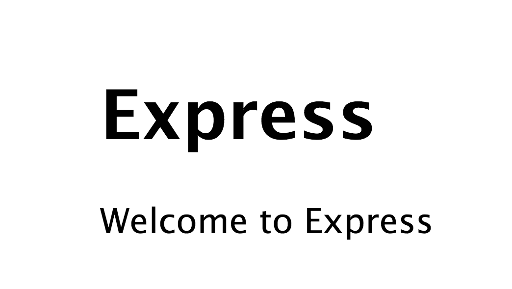

環境構築
=================

これからExpressを使ってWebアプリを構築しましょう。
構築にあたり、まずはExpressの環境構築から入ります。

Expressをインストールする。
----------------

`npm install`コマンドを利用すればnpmのモジュールをインストールすることができます。

ここでは次回に備えてexpressをインストールしてみましょう。

```shell
$ npm install express -g
```

`-g`オプションを入れることで特定のディレクトリの下ではなく、グローバルモジュールとして登録することができます。
expressコマンドが有効になれば成功です。

```shell
$ express --help

  Usage: express [options]

    Options:

        -h, --help          output usage information
        -V, --version       output the version number
        -s, --sessions      add session support
        -e, --ejs           add ejs engine support (defaults to jade)
        -J, --jshtml        add jshtml engine support (defaults to jade)
        -H, --hogan         add hogan.js engine support
        -c, --css <engine>  add stylesheet <engine> support (less|stylus) (defaults to plain css)
        -f, --force         force on non-empty directory
```

次に適当なフォルダを作成して、そこにexpressのテンプレートを作成します。

```shell
$ mkdir jscafe_express
$ cd jscafe_express
$ express .
$ npm install
```

これでほとんど完了です。
最後に確認のためにアプリを起動してみましょう。

```shell
$ node app
$ open http://localhost:3000/
```

もしも `Error: listen EADDRINUSE`というメッセージが出たら3000番ポートが使われている可能性があります。
変更するには、以下のコマンドを実行してから再実行して下さい。

```shell
$ export PATH=3001
$ node app
```

こんな感じの画面が出れば成功です。



まとめ
----------

- expressはWebアプリケーションフレームワーク
- expressコマンドを使うと初期テンプレートを作成してくれる
- node appで起動
